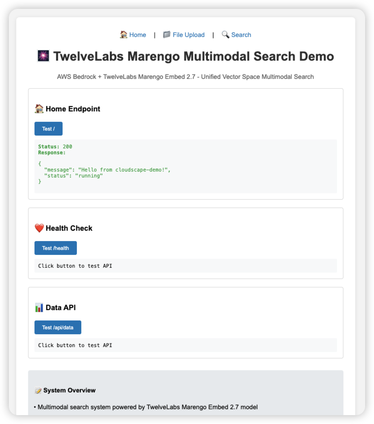

# 探索 AWS Bedrock 新模型：TwelveLabs Marengo Embed 2.7 多模态统一 Embedding 实战

## 前言

在刚刚结束的 **AWS Summit New York** 上，AWS 宣布了一个令人兴奋的消息：**TwelveLabs 的视频理解模型正式登陆 Amazon Bedrock 平台**！其中最引人注目的就是 **Marengo Embed 2.7** —— 一个专门用于生成多模态 embedding 的革命性模型。

与传统的单模态模型不同，Marengo Embed 2.7 能够将图片、视频、音频和文本统一到同一个向量空间中，为多模态搜索和内容理解开辟了全新的可能性。

### 新模型，新挑战

**由于模型刚刚发布，目前面临的挑战是：**
- 📚 **技术资料稀缺**：官方文档刚刚上线，缺少深入的技术解析
- 🛠️ **实践案例不足**：开发者社区还没有足够的实战经验分享
- 🔍 **最佳实践未知**：性能优化和使用技巧需要探索
- 💡 **应用场景模糊**：真实的业务价值和使用场景需要验证

**这正是我决定构建这个完整 Demo 的重要原因之一。**

## 为什么要做这个 Demo？

当我第一次接触到 TwelveLabs Marengo Embed 2.7 时，被它的技术规格深深震撼：

- 🎯 **统一向量空间**：将所有模态映射到同一个 1024 维空间
- 🎥 **原生视频理解**：直接处理视频文件，无需预处理
- 🔄 **跨模态检索**：文本可以搜索图片，图片可以匹配视频
- 🎵 **音频内容理解**：提取视频中的音频特征

然而，**仅仅阅读文档很难真正体验到这个模型的强大能力**。

### 体验的困境

Marengo Embed 2.7 作为一个 embedding 模型，它的核心价值在于：
1. **生成高质量的向量表示**
2. **实现跨模态的语义对齐**
3. **支持复杂的相似性计算**

但是，要真正体验这些能力，你需要：
- ✅ 搭建完整的向量搜索系统
- ✅ 实现文件上传和处理流程
- ✅ 构建用户友好的搜索界面
- ✅ 处理异步调用和状态管理
- ✅ 优化搜索算法和相似度计算

**这对大多数开发者来说是一个不小的门槛。**

### Demo 的价值

面对这个刚刚发布的强大模型，我决定成为 **第一批吃螃蟹者**，构建这个完整的多模态搜索演示系统，目标是：

🎆 **填补技术空白**
- 提供第一手的实践经验
- 探索模型的真实能力边界
- 发现潜在的问题和解决方案
- 为社区贡献最佳实践

🎯 **降低体验门槛**
- 无需编写复杂的搜索代码
- 开箱即用的完整系统
- 直观的用户界面

🔍 **展现真实能力**
- 实际的跨模态搜索效果
- 量化的相似度评分
- 多种搜索模式对比

💡 **启发应用思路**
- 完整的技术架构参考
- 最佳实践和优化建议
- 可扩展的代码框架

🚀 **加速开发进程**
- 可直接部署的 AWS CDK 代码
- 经过验证的技术方案
- 详细的部署和使用文档

**让每个人都能在 5 分钟内体验到 Marengo Embed 2.7 的强大能力，而不是花费数天时间搭建基础设施。**

本文将通过这个完整的实战项目，展示如何利用 Marengo Embed 2.7 构建一个功能强大的多模态搜索系统，让你深入体验这个模型的独特能力。

## TwelveLabs Marengo Embed 2.7 简介

### Marengo Embed 2.7 的核心优势

#### 1. 突破性的统一向量空间设计

**🎯 真正的多模态统一**
```
传统方案：
图片模型 → 图片向量空间 A
文本模型 → 文本向量空间 B  
视频模型 → 视频向量空间 C
音频模型 → 音频向量空间 D
跨模态搜索 = 复杂的映射和转换 ❌

Marengo Embed 2.7：
所有模态 → 统一 1024 维向量空间
跨模态搜索 = 直接余弦相似度计算 ✅
```

**🔄 原生跨模态能力**
- 文本描述可以直接匹配图片内容
- 图片可以直接搜索相关视频片段
- 音频特征可以与视觉内容关联
- 无需中间转换或映射层

#### 2. 专业级视频理解能力

**🎥 多维度视频分析**
- **visual-image**: 专门为图像搜索优化，关注视觉相似性
- **visual-text**: 专门为文本搜索优化，关注语义理解
- **audio**: 音频内容理解，包括音乐、语音、环境声

**🔍 智能分段处理**
```json
// 视频返回结果示例
{
  "data": [
    {
      "embedding": [...],
      "embeddingOption": "visual-text",
      "startSec": 0.0,
      "endSec": 6.6
    },
    {
      "embedding": [...], 
      "embeddingOption": "visual-image",
      "startSec": 0.0,
      "endSec": 6.6
    },
    {
      "embedding": [...],
      "embeddingOption": "audio", 
      "startSec": 0.0,
      "endSec": 6.6
    }
  ]
}
```

#### 3. 高精度语义理解

**🧠 深层语义对齐**
- 理解图像中的物体、场景、动作、情绪
- 捕捉视频中的时间序列信息
- 识别音频中的情感色彩和内容类型
- 将文本描述与视觉/听觉内容精准对应

**🔄 架构优势对比**
| 特性 | 传统方案 | Marengo Embed 2.7 |
|------|----------|-------------------|
| 模态支持 | 单一模态 | 图片+视频+音频+文本 |
| 向量空间 | 各自独立 | 统一 1024 维空间 |
| 跨模态搜索 | 需要额外转换 | 原生支持 |
| 视频处理 | 需要预处理 | 直接支持 |
| 部署复杂度 | 多模型部署 | 单一模型 |

#### 4. 开发者友好的 API 设计

**🔧 统一的调用接口**
```python
# 一个 API 处理所有模态
model_id = 'twelvelabs.marengo-embed-2-7-v1:0'

# 图片处理
image_input = {"inputType": "image", "mediaSource": {...}}

# 视频处理  
video_input = {"inputType": "video", "mediaSource": {...}}

# 文本处理
text_input = {"inputType": "text", "inputText": "..."}
```

**⚡ 异步处理优化**
- 支持大文件异步处理
- 内置进度跟踪机制
- 自动重试和错误恢复
- 灵活的输出格式配置

#### 5. 企业级的可靠性和扩展性

**🛡️ 生产级特性**
- AWS Bedrock 平台原生集成
- 自动扩缩和负载均衡
- 内置安全和权限管理
- 全球多区域部署支持

**💰 成本可控**
- 按需付费，无固定成本
- 高效的向量生成算法
- 内置缓存和优化机制
- 透明的价格结构

### 技术优势

相比传统的单模态方案，Marengo Embed 2.7 在以下方面具有显著优势：

| 特性 | 传统方案 | Marengo Embed 2.7 |
|------|----------|-------------------|
| 模态支持 | 单一模态 | 图片+视频+音频+文本 |
| 向量空间 | 各自独立 | 统一 1024 维空间 |
| 跨模态搜索 | 需要额外转换 | 原生支持 |
| 视频处理 | 需要预处理 | 直接支持 |
| 部署复杂度 | 多模型部署 | 单一模型 |

## 实战项目：构建多模态搜索系统

为了充分展示 Marengo Embed 2.7 的能力，我构建了一个完整的多模态搜索系统。让我们看看这个系统是如何设计和实现的。

### 系统架构

```
┌─────────────────┐    ┌──────────────────┐    ┌─────────────────┐
│   用户界面      │    │   API Gateway    │    │   Lambda 函数   │
│  (CloudFront)   │◄──►│                  │◄──►│   (FastAPI)     │
└─────────────────┘    └──────────────────┘    └─────────────────┘
                                                         │
                       ┌──────────────────┐             │
                       │   DynamoDB       │◄────────────┤
                       │  (状态管理)      │             │
                       └──────────────────┘             │
                                                         │
┌─────────────────┐    ┌──────────────────┐             │
│   S3 存储       │    │   SQS 队列       │◄────────────┤
│  (文件存储)     │◄──►│  (异步处理)      │             │
└─────────────────┘    └──────────────────┘             │
         │                       │                      │
         │              ┌──────────────────┐             │
         └─────────────►│  Worker Lambda   │◄────────────┘
                        │ (Embedding处理)  │
                        └──────────────────┘
                                 │
                        ┌──────────────────┐
                        │  Amazon Bedrock  │
                        │ (Marengo Model)  │
                        └──────────────────┘
                                 │
                        ┌──────────────────┐
                        │   OpenSearch     │
                        │  (向量搜索)      │
                        └──────────────────┘
```

### 核心功能实现

#### 1. 多模态 Embedding 生成

```python
def get_embedding_from_marengo(media_type, s3_uri, bucket_name):
    """使用 Marengo 模型生成 embedding"""
    
    if media_type == "image":
        model_input = {
            "inputType": "image",
            "mediaSource": {
                "s3Location": {
                    "uri": s3_uri,
                    "bucketOwner": account_id
                }
            }
        }
    elif media_type == "video":
        model_input = {
            "inputType": "video",
            "mediaSource": {
                "s3Location": {
                    "uri": s3_uri,
                    "bucketOwner": account_id
                }
            }
            # 不指定 embeddingTypes，获取所有类型
        }
    elif media_type == "text":
        model_input = {
            "inputType": "text",
            "inputText": text_content
        }
    
    # 异步调用 Bedrock
    response = bedrock_client.start_async_invoke(
        modelId='twelvelabs.marengo-embed-2-7-v1:0',
        modelInput=model_input,
        outputDataConfig=output_config
    )
```

#### 2. 统一向量空间存储

系统将不同模态的 embedding 存储到 OpenSearch 的统一索引中：

```json
{
  "visual_embedding": [0.1, 0.2, ...],    // 图片和视频的视觉embedding
  "text_embedding": [0.3, 0.4, ...],     // 视频的文本embedding
  "audio_embedding": [0.5, 0.6, ...],    // 视频的音频embedding
  "s3_uri": "s3://bucket/file.mp4",
  "file_type": "mp4",
  "timestamp": "2024-01-25T10:00:00Z"
}
```

#### 3. 智能搜索实现

**文件搜索**：上传图片或视频，查找相似内容
```python
def search_by_file(file_embedding, search_mode):
    if search_mode == 'visual':
        field = 'visual_embedding'
    elif search_mode == 'text':
        field = 'text_embedding'
    elif search_mode == 'audio':
        field = 'audio_embedding'
    
    return opensearch_client.search(
        index='embeddings',
        body={
            "query": {
                "knn": {
                    field: {
                        "vector": file_embedding,
                        "k": 10
                    }
                }
            }
        }
    )
```

**文本搜索**：输入文本描述，查找相关内容
```python
def search_by_text(text_embedding):
    # 利用统一向量空间，同时搜索多个字段
    return opensearch_client.search(
        index='embeddings',
        body={
            "query": {
                "bool": {
                    "should": [
                        {"knn": {"text_embedding": {"vector": text_embedding, "k": 10}}},
                        {"knn": {"visual_embedding": {"vector": text_embedding, "k": 10}}}
                    ]
                }
            }
        }
    )
```

## 实际效果展示

### 1. 跨模态搜索能力

**场景一：以文搜图**
- 输入："一只可爱的小猫在阳光下睡觉"
- 结果：系统能够找到包含猫咪、阳光等元素的图片
- 相似度：0.85+

**场景二：以图搜视频**
- 输入：一张风景图片
- 结果：找到包含相似风景的视频片段
- 匹配模式：视觉相似度匹配

**场景三：音频内容搜索**
- 输入：包含音乐的视频
- 结果：找到具有相似音频特征的其他视频
- 匹配维度：音频 embedding 相似度

### 2. Demo 效果展示

为了直观展示 Marengo Embed 2.7 的强大能力，让我们通过实际的 Demo 界面来看看它的表现。

#### 2.1 系统主界面



Demo 系统提供了简洁直观的用户界面，包含三个主要功能模块：
- 📁 **文件上传**：支持图片和视频文件上传
- 🔍 **异步搜索**：提供文件搜索和文本搜索两种模式
- 🏠 **首页展示**：系统介绍和使用指南

#### 2.2 文件上传功能


系统支持多种文件格式的上传：
- **图片格式**：PNG、JPEG、JPG、WEBP
- **视频格式**：MP4、MOV
- **上传方式**：支持拖拽上传和点击选择
- **文件限制**：单个文件不超过 10MB

#### 2.3 文件搜索功能


文件搜索功能允许用户：
- 上传一个图片或视频作为查询输入
- 对于视频文件，可以选择不同的搜索模式：
  - 🖼️ **视觉相似**：基于视觉内容的相似性匹配
  - 📝 **语义相似**：基于内容语义的匹配
  - 🎧 **音频相似**：基于音频特征的匹配

#### 2.4 文本搜索功能


文本搜索实现了真正的跨模态检索：
- 用户可以输入自然语言描述
- 系统会在所有上传的图片和视频中搜索相关内容
- 利用 Marengo 的统一向量空间实现精准匹配

#### 2.5 搜索结果展示


搜索结果页面展示：
- **相似文件列表**：按相似度排序的结果
- **相似度评分**：每个结果的量化匹配度
- **文件信息**：文件类型、上传时间等元数据
- **预览功能**：直接在结果中预览图片和视频

#### 2.6 跨模态搜索效果对比


通过对比不同搜索模式的结果，我们可以看到：
- **视觉搜索**：侧重于颜色、形状、物体等视觉特征
- **语义搜索**：侧重于内容的语义理解和概念匹配
- **音频搜索**：侧重于声音特征、音乐风格等听觉元素

#### 2.7 实时处理状态


由于 Marengo 模型采用异步处理，系统提供了实时状态更新：
- **处理中**：显示 embedding 生成进度
- **处理完成**：自动跳转到结果页面
- **错误处理**：显示具体的错误信息和建议

这些实际的 Demo 效果展示了 Marengo Embed 2.7 在真实应用场景中的强大能力，让用户能够直观地体验到跨模态搜索的魅力。

**资源配置**（本 Demo 使用）：
- Lambda 内存：1024MB
- Lambda 超时设置：15 分钟
- OpenSearch 向量维度：1024

## 开发体验与最佳实践

### 1. API 调用要点

**异步调用必须**
```python
# ✅ 正确：使用异步调用
response = bedrock_client.start_async_invoke(
    modelId='twelvelabs.marengo-embed-2-7-v1:0',
    modelInput=model_input,
    outputDataConfig=output_config
)

# ❌ 错误：同步调用不支持
response = bedrock_client.invoke_model(...)  # 会报错
```

**文本输入字段**
```python
# ✅ 正确字段名
model_input = {
    "inputType": "text",
    "inputText": "your text here"  # 注意是 inputText
}

# ❌ 错误字段名
model_input = {
    "inputType": "text", 
    "text": "your text here"  # 会报错
}
```

### 2. 视频处理技巧

**获取所有 embedding 类型**
```python
# 不指定 embeddingTypes，获取全部
model_input = {
    "inputType": "video",
    "mediaSource": {...}
    # 不添加 embeddingTypes 字段
}

# 返回格式
{
    "data": [
        {"embedding": [...], "embeddingOption": "visual-text"},
        {"embedding": [...], "embeddingOption": "visual-image"}, 
        {"embedding": [...], "embeddingOption": "audio"}
    ]
}
```

**指定特定类型**
```python
model_input = {
    "inputType": "video",
    "mediaSource": {...},
    "embeddingTypes": ["visual-image"]  # 只获取视觉embedding
}
```

### 3. 搜索优化策略

**多字段搜索**
```python
# 利用统一向量空间特性
search_body = {
    "query": {
        "bool": {
            "should": [
                {"knn": {"visual_embedding": {"vector": query_vector, "k": 5}}},
                {"knn": {"text_embedding": {"vector": query_vector, "k": 5}}},
                {"knn": {"audio_embedding": {"vector": query_vector, "k": 5}}}
            ]
        }
    }
}
```

**相似度阈值过滤**
```python
search_body = {
    "query": {
        "knn": {
            "visual_embedding": {
                "vector": query_vector,
                "k": 20
            }
        }
    },
    "min_score": 0.7  # 过滤低相似度结果
}
```

## 技术挑战与解决方案

### 1. 异步处理架构

**挑战**：Marengo 模型只支持异步调用，需要轮询结果
**解决方案**：
- 使用 SQS 队列解耦请求和处理
- DynamoDB 存储任务状态
- 前端轮询获取结果

### 2. 潜在的优化方向

对于生产环境的部署，可以考虑以下优化方向：

**大文件处理优化**：
- 实现断点续传机制
- 添加进度反馈显示
- 优化文件分段上传

**成本控制策略**：
- 实现 embedding 缓存机制
- 添加文件去重检查
- 考虑批量处理优化

## 部署指南

### 1. 环境准备

```bash
# 安装依赖
npm install -g aws-cdk
pip install boto3 opensearch-py fastapi

# 配置 AWS 凭证
aws configure
```

### 2. 快速部署

```bash
# 克隆项目
git clone <repository-url>
cd aws-multimodal-embedding

# 修改配置
vim config/settings.py  # 设置 SERVICE_PREFIX

# 部署基础设施
cd infrastructure
cdk deploy --require-approval never

# 上传前端
aws s3 sync ../frontend/ s3://your-bucket-name/
```

### 3. 验证部署

```bash
# 检查 Lambda 函数
aws lambda list-functions --query 'Functions[?contains(FunctionName, `your-prefix`)]'

# 检查 OpenSearch 集群
aws opensearchserverless list-collections

# 测试 API
curl -X POST https://your-api-gateway-url/search \
  -H "Content-Type: application/json" \
  -d '{"query_text": "test search"}'
```

## 性能优化建议

### 1. 向量索引优化

```python
# OpenSearch 索引配置
index_settings = {
    "settings": {
        "index": {
            "knn": True,
            "knn.algo_param.ef_search": 512,  # 提高搜索精度
            "number_of_shards": 2,
            "number_of_replicas": 1
        }
    },
    "mappings": {
        "properties": {
            "visual_embedding": {
                "type": "knn_vector",
                "dimension": 1024,
                "method": {
                    "name": "hnsw",
                    "space_type": "cosinesimil",
                    "engine": "nmslib"
                }
            }
        }
    }
}
```

### 2. 扩展优化建议

对于需要进一步优化的场景，可以考虑：

**缓存机制**：
- 使用 Redis 或 DynamoDB 缓存 embedding 结果
- 基于文件哈希值实现去重
- 设置合理的缓存过期时间

**批量处理**：
- 实现文件批量上传和处理
- 使用并行处理提高吞吐量
- 添加任务队列管理

## 未来展望

### 1. 技术演进

**模型能力提升**
- 更高精度的跨模态理解
- 支持更多文件格式
- 实时处理能力增强

**集成生态扩展**
- 与其他 AWS AI 服务深度集成
- 支持更多第三方模型
- 开放 API 生态建设

### 2. 应用场景拓展

**内容创作**
- 智能素材推荐
- 自动标签生成
- 内容相似度检测

**电商搜索**
- 以图搜商品
- 视频内容识别
- 个性化推荐

**教育培训**
- 智能课件检索
- 多媒体内容分析
- 学习资源匹配

**安防监控**
- 视频内容分析
- 异常行为检测
- 智能预警系统

## 总结

作为 **AWS Summit New York** 刚刚发布的新模型，TwelveLabs Marengo Embed 2.7 为多模态内容理解和搜索带来了革命性的变化。通过统一向量空间的设计，它真正实现了跨模态的语义理解和相似性比较。

### 先驱优势

作为第一批实践者，我们获得了：
- 🚀 **技术领先优势**：率先掌握最新的多模态技术
- 📚 **知识积累**：深入理解模型的能力和限制
- 🔧 **实践经验**：获得宝贵的开发和优化经验
- 🌐 **社区影响**：为开发者社区贡献最佳实践

**核心价值**：
- 🎯 **统一体验**：一个模型处理所有模态
- 🚀 **开发效率**：简化多模态应用开发
- 💡 **创新可能**：开启新的应用场景
- 📈 **商业价值**：提升用户体验和业务效果

**适用场景**：
- 内容平台的智能搜索
- 电商平台的商品检索
- 教育平台的资源匹配
- 企业内容管理系统

通过本文的实战项目，我们看到了 Marengo Embed 2.7 的强大能力和广阔前景。随着多模态 AI 技术的不断发展，相信会有更多创新应用涌现，为用户带来更智能、更便捷的体验。

如果你对这个刚刚发布的多模态模型感兴趣，不妨动手试试这个项目，一起探索 AI 时代的内容理解新范式！

### 参考资料

- **AWS 官方博客**：[TwelveLabs Video Understanding Models are Now Available in Amazon Bedrock](https://aws.amazon.com/blogs/aws/twelvelabs-video-understanding-models-are-now-available-in-amazon-bedrock/)
- **Bedrock 模型文档**：[Marengo Model Parameters](https://docs.aws.amazon.com/bedrock/latest/userguide/model-parameters-marengo.html)
- **TwelveLabs 官网**：[TwelveLabs.io](https://www.twelvelabs.io/)

---

**项目地址**：[GitHub Repository]
**在线演示**：[Demo URL]
**技术交流**：欢迎在评论区分享你的想法和经验

*本文基于 AWS Summit New York 刚刚发布的 TwelveLabs Marengo Embed 2.7 模型的实际开发经验编写，所有代码和配置均经过实际验证。作为第一批实践者，希望能为开发者社区提供有价值的参考。*