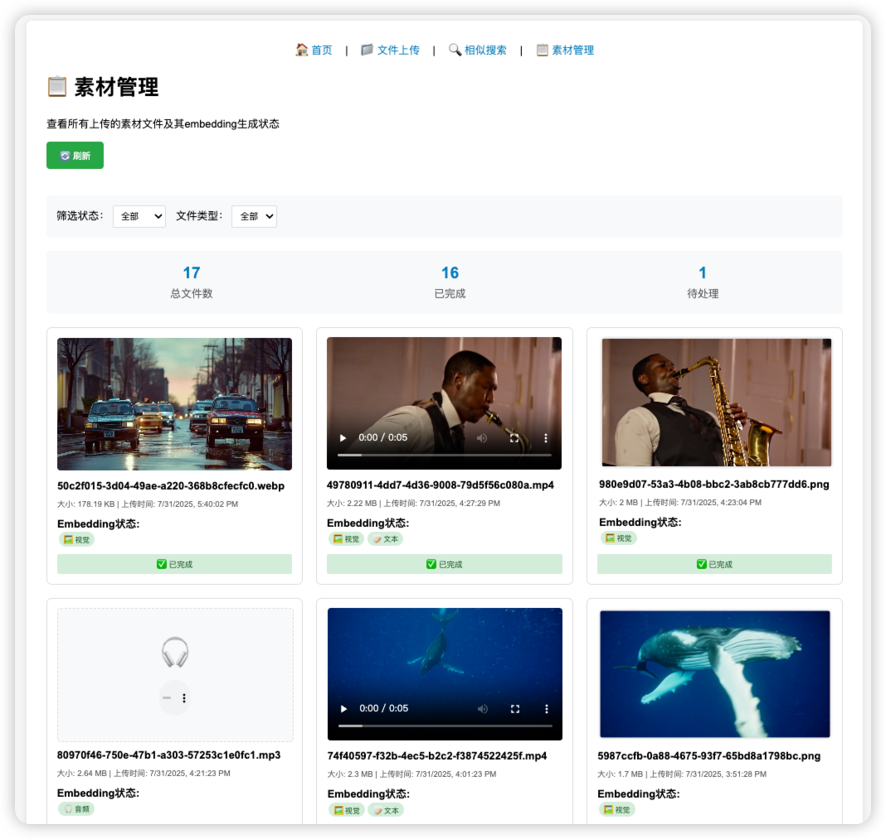
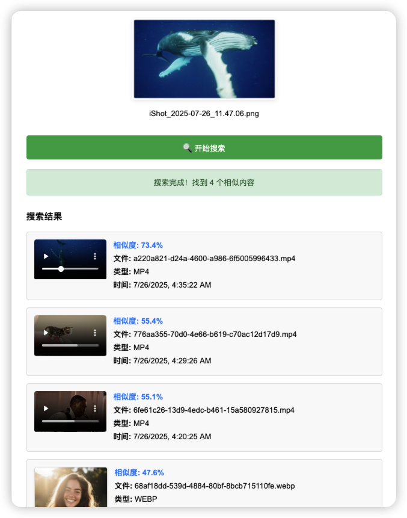
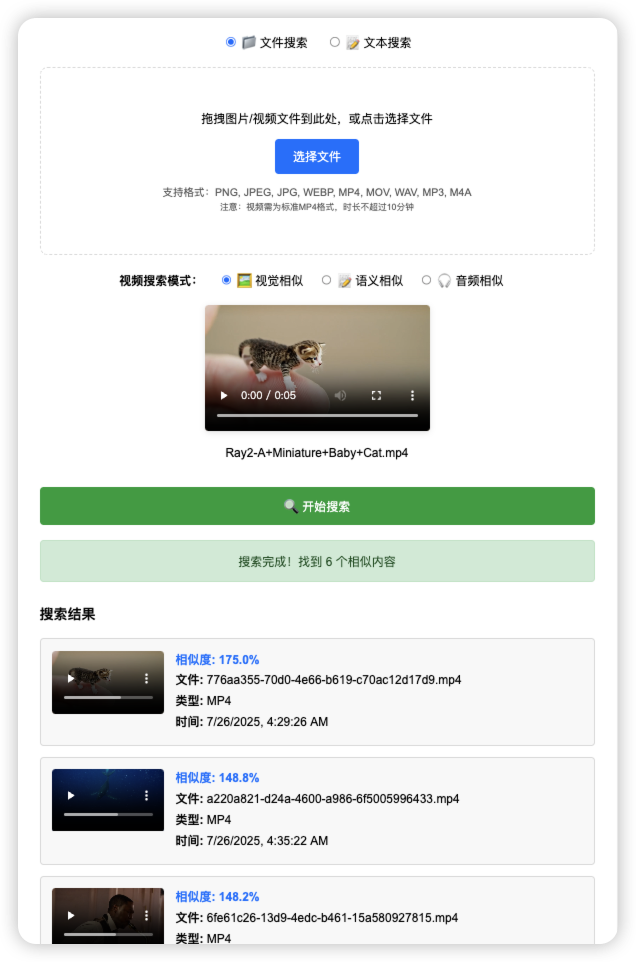
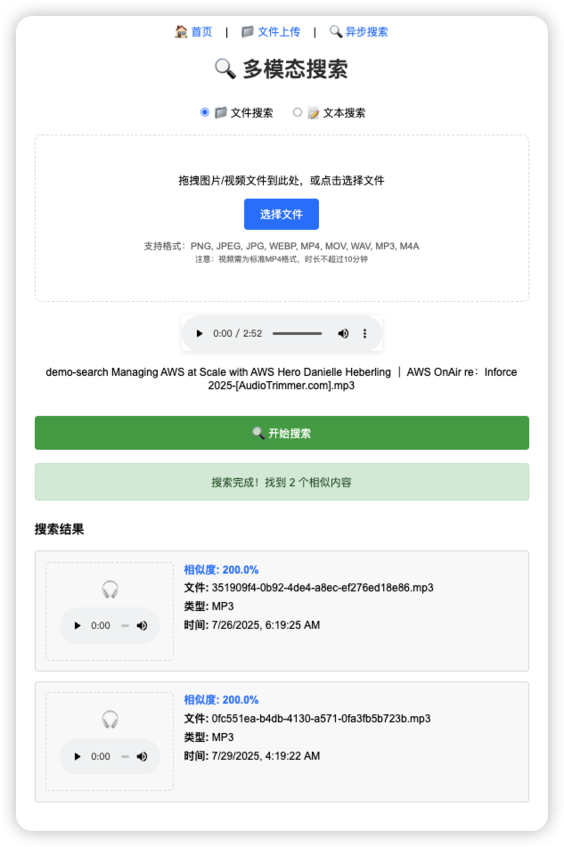

# Building a Multimodal Search System with TwelveLabs Marengo Embed 2.7 on Amazon Bedrock

*This article demonstrates how to build a production-ready multimodal search application through AI-assisted development with zero manual coding, showcasing the complete cross-modal AI capabilities of TwelveLabs Marengo Embed 2.7 model on Amazon Bedrock.*

## 🚀 Project Highlights

### 🎯 Complete Multimodal Experience System
Built an **end-to-end multimodal search demonstration system** that allows users to intuitively experience the powerful cross-modal capabilities of Marengo Embed 2.7, including text-to-image, text-to-video, text-to-audio, and file-to-file similarity search.

### ✨ AI-Assisted Development Practice
This project was **completed entirely through AI-assisted development**, with developers writing no code manually. From architecture design, code implementation, deployment configuration to problem debugging, the entire process was completed by Amazon Q Developer AI assistant, demonstrating the enormous potential of AI-driven development.

## Introduction

At AWS Summit New York, we announced that TwelveLabs video understanding models are now available on Amazon Bedrock, including the breakthrough **Marengo Embed 2.7** model. This model represents a significant advancement in multimodal AI, providing unified embedding generation across images, videos, audio, and text within a single 1024-dimensional vector space.

This technological breakthrough is significant for solving real-world business challenges. Take the gaming industry as an example: companies need to create massive amounts of advertising video materials for A/B testing when launching game products. Some gaming companies have advertising video material libraries exceeding **100,000+** assets, growing by tens of thousands monthly. Faced with such massive material libraries, traditional filename and tag-based retrieval methods can no longer meet the demands. Designers frequently need to retrieve and extract material information and segments from vast video libraries to gain creative inspiration or splice new advertising videos. This cross-modal search requirement—finding relevant video materials through text descriptions, reference images, or audio clips—is the ideal application scenario for multimodal AI technology.

Unlike traditional approaches that require separate models for each modality, Marengo Embed 2.7 achieves true cross-modal understanding, allowing developers to build applications where text queries can find relevant images, images can match similar videos, and audio content can be semantically linked with visual elements. This capability applies not only to the gaming industry but can also be reused in performance advertising, educational training, e-commerce platforms, media content, and other industries requiring extensive multimedia content management and retrieval.

**Even more exciting is that the complete multimodal search system demonstrated in this article was implemented entirely through AI-assisted development, requiring no manual coding, opening new possibilities for AI-driven software development.**

## What Makes Marengo Embed 2.7 Unique

### Unified Vector Space Architecture

Traditional multimodal systems face the challenge of aligning different vector spaces:

```
Traditional Approach:
Image Model → Image Vector Space A
Text Model → Text Vector Space B  
Video Model → Video Vector Space C
Audio Model → Audio Vector Space D
Cross-modal Search = Complex mapping and transformation ❌

Marengo Embed 2.7:
All Modalities → Unified 1024-dimensional Vector Space
Cross-modal Search = Direct cosine similarity calculation ✅
```

### Advanced Video Understanding

The model provides three different embedding types for video content:
- **visual-image**: Optimized for visual similarity matching
- **visual-text**: Designed specifically for semantic text-to-video search
- **audio**: Captures audio features including music, speech, and environmental sounds

### Enterprise-Grade Features

- **Asynchronous Processing**: Built for production workloads with large files
- **AWS Integration**: Native integration with Amazon Bedrock infrastructure
- **Scalable Architecture**: Automatic scaling and load balancing
- **Security**: Built-in access control and encryption

## Solution Architecture

### Solution Overview

Addressing the challenge of gaming companies needing to create massive amounts of advertising videos when launching new game products, we built a multimodal search solution based on Marengo Embed 2.7. Since these videos typically have short lifecycles (lasting only days to weeks), gaming companies must continuously create new videos for A/B testing to ensure consistent advertising performance.

**Gaming companies currently use three main approaches to create advertising video content:**

1. **Using In-Game Assets**: Utilizing in-game assets to create videos related to gameplay
2. **Leveraging Large Language Models**: Using AI to generate advertising video segments, then combining them into complete videos
3. **Material Decomposition and Recombination**: Breaking down existing advertising videos into small segments, then recombining them into new advertising creatives

Among these, **the third method is particularly useful in A/B testing**, providing numerous advertising variants, especially suitable for ads that don't contain in-game elements. In this production process, gaming companies build massive video material libraries with assets from various sources. **Searching for suitable advertising segments from this material library consumes significant human resources daily**. Some companies are also exploring cross-modal retrieval technologies to simplify this process.

When building material management solutions, **Marengo Embed 2.7 multimodal embedding model can serve as the core**, mapping all media types (images, videos, audio, text) to a unified 1024-dimensional vector space for efficient cross-modal material retrieval. Combined with large language model understanding capabilities, this further enhances the intelligence level of material management, effectively solving the core pain points in the third method. This article demonstrates the practical application effects of these technical approaches by building a demonstration system.

### Business Value

This solution **accelerates content creation and improves advertising performance** through automated asset retrieval and leveraging existing resources. This not only **reduces labor costs** but also **optimizes resource utilization**, enabling designers to quickly locate relevant videos through multimodal retrieval methods such as text descriptions, reference images, or audio clips.

### Technical Implementation

To fully experience the capabilities of Marengo Embed 2.7, we built a comprehensive multimodal search system based on **Serverless architecture** through **AI-assisted development**. Throughout the entire development process, from architecture design to code implementation, from deployment configuration to problem debugging, **developers wrote no code manually**, with the entire process completed by Amazon Q Developer AI assistant:


### System Execution Flow

The system operates through two main workflows: **File Upload and Processing** and **Search and Retrieval**.

#### File Upload and Processing Workflow

 **User Interaction**: Users access the web interface through Amazon CloudFront, uploading media files (images, videos, audio) via drag-and-drop or file selection.

 **API Processing**: Files are converted to base64 format and sent through Amazon API Gateway to the main AWS Lambda function for file type and size limit validation (maximum 10MB).

 **Amazon S3 Storage**: AWS Lambda decodes base64 data and uploads raw files to Amazon S3 for persistent storage.

 **Amazon S3 Event Trigger**: Amazon S3 automatically triggers a dedicated embedding AWS Lambda function when new files are uploaded, initiating the embedding generation process.

 **Amazon Bedrock Invocation**: The embedding AWS Lambda asynchronously invokes Amazon Bedrock's Marengo Embed 2.7 model to generate unified 1024-dimensional embedding vectors for all media types.

 **Vector Storage**: The embedding AWS Lambda stores generated embedding vectors along with metadata in Amazon OpenSearch Service, creating a searchable vector database.

#### Search and Retrieval Workflow

 **Search Request**: Users initiate searches through the web interface using uploaded files or text queries, with options to select different search modes (visual, semantic, audio).

 **API Processing**: Search requests are sent through Amazon API Gateway to the search API AWS Lambda function for initial processing.

 **Task Creation**: The search API AWS Lambda creates search task records in Amazon DynamoDB and sends messages to Amazon SQS queue for asynchronous processing.

 **Queue Processing**: The search API AWS Lambda sends messages to Amazon SQS queue for asynchronous processing.

 **Worker Activation**: The search worker AWS Lambda is triggered by Amazon SQS messages, extracting search parameters and preparing for embedding generation.

 **Query Embedding**: The worker AWS Lambda invokes Amazon Bedrock's Marengo model to generate embedding vectors for search queries (text or uploaded files).

 **Vector Search**: The worker AWS Lambda performs similarity search using cosine similarity in Amazon OpenSearch Service, using different strategies for cross-modal queries, then updates results in Amazon DynamoDB for frontend polling.

### Workflow Integration

The two workflows share common infrastructure components but serve different purposes:
- **Upload Workflow (1-6)**: Focuses on ingesting and processing media files to build a searchable vector database
- **Search Workflow (1-7)**: Handles user queries and retrieves relevant results from the pre-built vector database
- **Shared Components**: Both workflows utilize the same Amazon Bedrock model, Amazon OpenSearch Service indexes, and core AWS services for consistency

### Key Technical Features

- **Unified Vector Space**: All media types (images, videos, audio, text) are embedded into the same 1024-dimensional space, enabling true cross-modal search
- **Asynchronous Processing**: Marengo Embed 2.7 requires asynchronous invocation, handled through Amazon SQS queues and worker AWS Lambda functions
- **Multimodal Search**: Supports text-to-image, text-to-video, text-to-audio, and file-to-file similarity search
- **Scalable Architecture**: Serverless design automatically scales based on demand without infrastructure management
- **Real-time Status**: WebSocket-like polling provides real-time updates on processing status and search results

## Demo Walkthrough

To illustrate the system's capabilities, let's walk through the user interface and key features:

### System Overview


The application provides an intuitive interface with three main modules:
- **File Upload**: Support for image, video, and audio files
- **Asynchronous Search**: File-based and text-based search modes
- **Real-time Processing**: Status tracking and result display

### File Upload and Processing


The system supports multiple media formats with drag-and-drop functionality:
- **Image Formats**: PNG, JPEG, JPG, WEBP
- **Video Formats**: MP4, MOV
- **Audio Formats**: WAV, MP3, M4A
- **File Size Limit**: 10MB per file

### Search Capabilities


Users can upload media files to find similar content across different modalities. For example, in a gaming advertising material library, designers can upload a reference video containing specific game characters, and the system will automatically find other advertising materials containing similar characters or scenes. For video files, the system provides multiple search modes:
- **Visual Similarity**: Based on visual content matching, suitable for finding similar scenes or character appearances
- **Semantic Similarity**: Based on content understanding, suitable for finding similar actions or plots
- **Audio Similarity**: Based on audio feature matching, suitable for finding similar background music or sound effects


Text-based search achieves true cross-modal retrieval, allowing users to find relevant images, videos, and audio content using natural language descriptions. In gaming advertising production, this means designers can input descriptions like "character combat" or "castle scenes" to quickly find matching advertising materials.

### Search Results and Cross-Modal Matching


Result display includes:
- **Similarity Scores**: Quantified matching confidence
- **Media Preview**: Direct playback for videos and audio
- **Metadata**: File type, upload time, and other details
- **Sorting**: Results ranked by relevance


The system demonstrates different search modes:
- **Visual Search**: Focuses on colors, shapes, and visual elements
- **Semantic Search**: Emphasizes content understanding and conceptual matching
- **Audio Search**: Targets sound characteristics and audio properties

### Asynchronous Processing


Due to Marengo's asynchronous processing model, the system provides real-time status updates:
- **Processing Status**: Shows embedding generation progress
- **Completion Notifications**: Automatic redirection to results
- **Error Handling**: Clear error messages and suggestions

### Material Management



The system provides comprehensive material management functionality, helping users effectively manage and monitor uploaded multimedia content. For gaming companies, this means centralized management of tens of thousands or even hundreds of thousands of advertising video materials:
- **Material Display**: Card-based display of all uploaded gaming advertising videos, character images, and sound effect files
- **Processing Status Monitoring**: Real-time display of embedding generation status for each material, ensuring newly uploaded advertising materials can be searched promptly
- **Smart Filtering**: Support for filtering by material type (character showcase, game scenes, skill effects) and processing status
- **Status Indicators**: Color-coded clear identification of different processing statuses, helping art teams quickly identify available materials
- **Batch Management**: Convenient for art and planning teams to batch view and manage large numbers of advertising material files

### Multimodal Search Practical Demonstrations

The system supports multiple search modes. The following shows various cross-modal search scenarios in actual operation. These features are particularly useful in gaming advertising production, significantly improving designers' creative efficiency and material reuse rates:

#### Image Search



Using images as query input, the system can:
- **Visual Similarity Matching**: Find images and videos with similar visual characteristics. In gaming advertising production, designers can upload a character image to quickly find all advertising videos containing similar characters
- **Cross-Modal Retrieval**: Discover related media based on visual content, such as finding related background music or sound effects through scene screenshots
- **Real-time Processing**: Immediately start embedding generation and search after uploading images, supporting rapid creative iteration

#### Video Search



Video file search demonstrates the powerful multimodal capabilities of Marengo Embed 2.7:
- **Multiple Embedding Generation**: Simultaneously extract visual, text, and audio features
- **Smart Matching**: Select the best embedding for search based on content type
- **Asynchronous Processing**: Complete workflow for processing large video files

#### Audio Search



Cross-modal search capabilities for audio files:
- **Audio Format Support**: Mainstream formats WAV, MP3, M4A
- **Audio Feature Extraction**: Capture music, speech, and environmental sound features
- **Similarity Matching**: Find content with similar audio characteristics

#### Text-to-Image and Video Search


Cross-modal retrieval of text queries demonstrates true semantic understanding:
- **Natural Language Processing**: Understand complex text descriptions. In gaming advertising production, designers can input descriptions like "intense battle scenes" or "multiplayer team cooperation"
- **Cross-Modal Matching**: Text descriptions match related game screenshots and advertising video content, helping designers quickly find materials that match creative directions
- **Semantic Similarity**: Based on content understanding rather than keyword matching, able to understand plots and emotional expressions in games

#### Text-to-Audio Search


Text-to-audio cross-modal search demonstrates the powerful semantic understanding capabilities of Marengo Embed 2.7:
- **Semantic Audio Matching**: Use natural language descriptions to find related audio content, such as "cheerful music," "ocean waves," etc.
- **Audio Player Integration**: Direct playback controls in search results, supporting instant listening
- **Similarity Scoring**: Quantify the accuracy of text-to-audio content matching, helping users understand result relevance
- **Audio Content Matching**: Semantic matching based on audio features, supporting various audio file formats

## Implementation Details

### 1. Embedding Generation

Core functionality leverages Marengo Embed 2.7's unified API for all media types:

```python
def generate_embedding(media_type, s3_uri, bucket_name):
    """Generate embeddings using Marengo Embed 2.7"""
    
    # Configure input based on media type
    if media_type == "image":
        model_input = {
            "inputType": "image",
            "mediaSource": {
                "s3Location": {
                    "uri": s3_uri,
                    "bucketOwner": account_id
                }
            }
        }
    elif media_type == "video":
        model_input = {
            "inputType": "video",
            "mediaSource": {
                "s3Location": {
                    "uri": s3_uri,
                    "bucketOwner": account_id
                }
            }
            # Omit embeddingTypes to get all available types
        }
    elif media_type == "audio":
        model_input = {
            "inputType": "audio",
            "mediaSource": {
                "s3Location": {
                    "uri": s3_uri,
                    "bucketOwner": account_id
                }
            }
        }
    elif media_type == "text":
        model_input = {
            "inputType": "text",
            "inputText": text_content
        }
    
    # Asynchronous invocation (required for Marengo)
    response = bedrock_client.start_async_invoke(
        modelId='twelvelabs.marengo-embed-2-7-v1:0',
        modelInput=model_input,
        outputDataConfig=output_config
    )
    
    return response
```

### 2. Vector Storage Strategy

The system uses a unified schema to store embeddings in Amazon OpenSearch Service:

```json
{
  "visual_embedding": [0.1, 0.2, ...],    // Image and video visual features
  "text_embedding": [0.3, 0.4, ...],     // Video text/semantic features  
  "audio_embedding": [0.5, 0.6, ...],    // Video and audio features
  "s3_uri": "s3://bucket/file.mp4",
  "file_type": "mp4",
  "timestamp": "2024-01-25T10:00:00Z"
}
```

### 3. Intelligent Search Implementation

Search logic adapts based on query type and target media:

```python
def cross_modal_search(query_embedding, query_type):
    """Implement cross-modal search logic"""
    
    if query_type == 'text':
        # Text query: search images through visual_embedding,
        # search videos through text_embedding, search audio through audio_embedding
        search_body = {
            "query": {
                "bool": {
                    "should": [
                        {
                            "bool": {
                                "must": [
                                    {"knn": {"visual_embedding": {"vector": query_embedding, "k": 5}}},
                                    {"terms": {"file_type": ["png", "jpg", "jpeg", "webp"]}}
                                ]
                            }
                        },
                        {
                            "bool": {
                                "must": [
                                    {"knn": {"text_embedding": {"vector": query_embedding, "k": 5}}},
                                    {"terms": {"file_type": ["mp4", "mov"]}}
                                ]
                            }
                        },
                        {
                            "bool": {
                                "must": [
                                    {"knn": {"audio_embedding": {"vector": query_embedding, "k": 5}}},
                                    {"terms": {"file_type": ["wav", "mp3", "m4a"]}}
                                ]
                            }
                        }
                    ]
                }
            }
        }
    else:
        # File query: use visual_embedding for similarity search
        search_body = {
            "query": {
                "knn": {
                    "visual_embedding": {
                        "vector": query_embedding,
                        "k": 10
                    }
                }
            }
        }
    
    return opensearch_client.search(index='embeddings', body=search_body)
```

## Key Features and Capabilities

### Supported Media Formats
- **Images**: PNG, JPEG, JPG, WEBP
- **Videos**: MP4, MOV  
- **Audio**: WAV, MP3, M4A
- **Text**: Natural language queries

### Cross-Modal Search Scenarios

1. **Text-to-Image**: Find images matching text descriptions
2. **Text-to-Video**: Locate video content based on semantic queries
3. **Text-to-Audio**: Discover audio content through descriptive text
4. **Image-to-Video**: Find videos with similar visual content
5. **File-to-File**: Locate similar media across all formats

## Performance Metrics

Based on testing with the demonstration system, here are key performance characteristics:

### Processing Times
- **Text Embedding**: 2-5 seconds
- **Image Embedding**: 10-30 seconds  
- **Video Embedding**: 1-5 minutes (depending on length)
- **Audio Embedding**: 30 seconds-2 minutes

### Search Performance
- **Query Response Time**: Vector similarity search <500ms
- **Concurrent Users**: Auto-scaling through Lambda
- **Storage Efficiency**: 1024-dimensional vectors (4KB per embedding)

## Performance and Scalability

### Resource Configuration
- **AWS Lambda Memory**: 1024MB for embedding processing
- **AWS Lambda Timeout**: 15 minutes for large file processing
- **Amazon OpenSearch Service**: 1024-dimensional vector space
- **File Size Limit**: 10MB per file (Amazon API Gateway constraint)

## Best Practices and Lessons Learned

### 1. Asynchronous Processing is Critical
Marengo Embed 2.7 only supports asynchronous invocation. Design your architecture accordingly:

```python
# ✅ Correct: Asynchronous invocation
response = bedrock_client.start_async_invoke(
    modelId='twelvelabs.marengo-embed-2-7-v1:0',
    modelInput=model_input,
    outputDataConfig=output_config
)

# ❌ Wrong: Synchronous invocation will fail
response = bedrock_client.invoke_model(...)
```

### 2. Optimize for Different Media Types
- **Images**: Single visual embedding
- **Videos**: Multiple embeddings (visual-image, visual-text, audio)
- **Audio**: Single audio embedding
- **Text**: Single text embedding

### 3. Implement Proper Error Handling
```python
def poll_async_result(invocation_arn, max_attempts=60):
    """Poll async invocation results with proper error handling"""
    for attempt in range(max_attempts):
        try:
            response = bedrock_client.get_async_invoke(invocationArn=invocation_arn)
            
            if response["status"] == "Completed":
                return process_output(response)
            elif response["status"] in ("Failed", "Cancelled"):
                raise Exception(f"Invocation failed: {response.get('failureMessage')}")
                
            time.sleep(5)  # Wait before next poll
            
        except Exception as e:
            if attempt == max_attempts - 1:
                raise e
            time.sleep(5)
    
    raise TimeoutError("Async invocation timeout")
```

## Deployment Guide

### Prerequisites
- AWS CLI configured with appropriate permissions
- AWS CDK v2 installed
- Python 3.11+ and Node.js 18+

### Quick Deployment
```bash
# Clone repository
git clone <repository-url>
cd aws-multimodal-embedding

# Configure service prefix
export SERVICE_PREFIX="your-project-name"

# Deploy infrastructure
cd infrastructure
cdk deploy --require-approval never

# Upload frontend assets
aws s3 sync ../frontend/ s3://${SERVICE_PREFIX}-frontend/
```

### Required AWS Permissions
Deployment requires the following permissions:
- Amazon Bedrock model access
- AWS Lambda function creation and execution
- Amazon OpenSearch Serverless collection management
- Amazon S3 bucket operations
- Amazon API Gateway configuration
- Amazon CloudFront distribution setup

## Use Cases and Applications

### Gaming and Advertising Industry
- **Gaming Advertising Material Management**: Facing 100,000+ level advertising video libraries, quickly find relevant materials through text descriptions, reference images, or audio clips
- **Performance Advertising Reuse**: Similar to gaming advertising, requiring extensive A/B testing and rapid iteration, can directly reuse multimodal search solutions
- **Creative Inspiration Acquisition**: Designers quickly find similar-style historical materials as references through cross-modal search

### Education and Enterprise Training
- **Course Video Resource Management**: Teachers quickly find relevant teaching materials through keywords
- **Multimedia Educational Resource Retrieval**: Cross-modal retrieval and recommendation of related learning content
- **Enterprise Training Library Management**: Employees quickly find relevant training content through descriptions

### E-commerce Platforms
- **Product Video Library Management**: Quickly find relevant product demonstration videos through product descriptions
- **Visual Product Search**: Users upload images to search for video introductions of similar products
- **Cross-Modal Product Matching**: Match product videos with customer queries

### Media Content Management
- **News Material Library Management**: Quickly find relevant video clips through text descriptions
- **Film and TV Post-Production**: Material search and reuse, improving production efficiency
- **Content Archive Management**: Intelligent search in massive multimedia archives

## Security Recommendations

### Data Privacy
- All media files processed within your AWS account
- Embeddings stored in your OpenSearch cluster
- No data shared with external services

### Access Control
```python
# IAM policy for AWS Lambda execution role
{
    "Version": "2012-10-17",
    "Statement": [
        {
            "Effect": "Allow",
            "Action": [
                "bedrock:InvokeModel",
                "bedrock:StartAsyncInvoke",
                "bedrock:GetAsyncInvoke"
            ],
            "Resource": "arn:aws:bedrock:*:*:model/twelvelabs.marengo-embed-2-7-v1:0"
        },
        {
            "Effect": "Allow",
            "Action": [
                "s3:GetObject",
                "s3:PutObject"
            ],
            "Resource": "arn:aws:s3:::your-bucket/*"
        }
    ]
}
```

## Future Enhancements

### Potential Features
- **Real-time Processing**: Streaming embeddings for live content
- **Advanced Filtering**: Search refinement based on metadata
- **Multi-language Support**: Extended language capabilities
- **Custom Models**: Fine-tuning for domain-specific use cases
- **Cost Optimization**: Embedding caching strategies and batch processing optimization to reduce API call costs

```python
def get_cached_embedding(file_hash, media_type):
    """Implement caching to reduce API calls"""
    cache_key = f"{file_hash}:{media_type}"
    
    # Check Amazon DynamoDB cache
    cached_result = dynamodb_table.get_item(Key={'cache_key': cache_key})
    
    if 'Item' in cached_result:
        return cached_result['Item']['embedding']
    
    # Generate new embedding if not cached
    embedding = generate_embedding(media_type, s3_uri, bucket_name)
    
    # Store in cache
    dynamodb_table.put_item(
        Item={
            'cache_key': cache_key,
            'embedding': embedding,
            'ttl': int(time.time()) + ttl_seconds  # Set appropriate TTL
        }
    )
    
    return embedding
```

For large-scale deployments, consider implementing batch processing to optimize costs and throughput.

### Integration Opportunities
- **Amazon Rekognition**: Enhanced image analysis
- **Amazon Transcribe**: Audio-to-text conversion
- **Amazon Translate**: Multi-language search capabilities
- **Amazon Personalize**: Personalized content recommendations

## Conclusion

TwelveLabs Marengo Embed 2.7 on Amazon Bedrock represents a significant advancement in multimodal AI capabilities. By providing a unified vector space for all media types, it simplifies the development of complex cross-modal search applications while maintaining enterprise-grade performance and security.

Returning to the business scenario mentioned at the beginning of the article, the challenge of managing 100,000+ level advertising video materials faced by gaming companies is the ideal application scenario for multimodal AI technology. Through the solution demonstrated in this article, designers can now:

- **Through natural language descriptions** quickly locate relevant advertising materials, such as "intense battle scenes" or "multiplayer team cooperation"
- **Upload reference images or audio clips** to find video materials with similar styles, significantly improving creative efficiency
- **Achieve cross-modal material reuse**, making the third production method of decomposing and recombining existing advertising videos more efficient
- **Significantly reduce labor costs**, transitioning from manual search that consumes significant human resources daily to intelligent retrieval

The serverless architecture demonstrated in this article shows how to build auto-scaling, production-ready multimodal applications while maintaining cost optimization. At the same time, the entire system was implemented completely through AI-assisted development, demonstrating the enormous potential of AI-driven development in solving real business problems.

### Key Takeaways
- **Unified Approach**: Single model handles all media types
- **Production Ready**: Built on AWS serverless infrastructure  
- **Cost Effective**: Pay-as-you-use pricing and optimization strategies
- **Scalable**: Auto-scaling based on demand
- **Secure**: Enterprise-grade security and privacy controls

For industries requiring extensive multimedia content management such as gaming, advertising, education, and e-commerce, Marengo Embed 2.7 provides an accessible entry point with powerful cross-modal understanding capabilities. As multimodal AI continues to evolve, such solutions will become key technologies for unlocking the value of diverse media assets.

---

## Additional Resources

- [Amazon Bedrock User Guide](https://docs.aws.amazon.com/bedrock/)
- [TwelveLabs Marengo Model Documentation](https://docs.aws.amazon.com/bedrock/latest/userguide/model-parameters-marengo.html)
- [Amazon OpenSearch Service Developer Guide](https://docs.aws.amazon.com/opensearch-service/)
- [AWS CDK Developer Guide](https://docs.aws.amazon.com/cdk/)

*The example code and architectural patterns shown in this article are available in the [GitHub repository](https://github.com/valyli/aws-multimodal-embedding).*