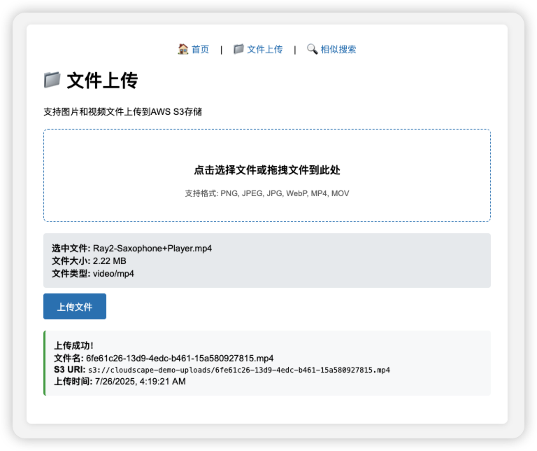
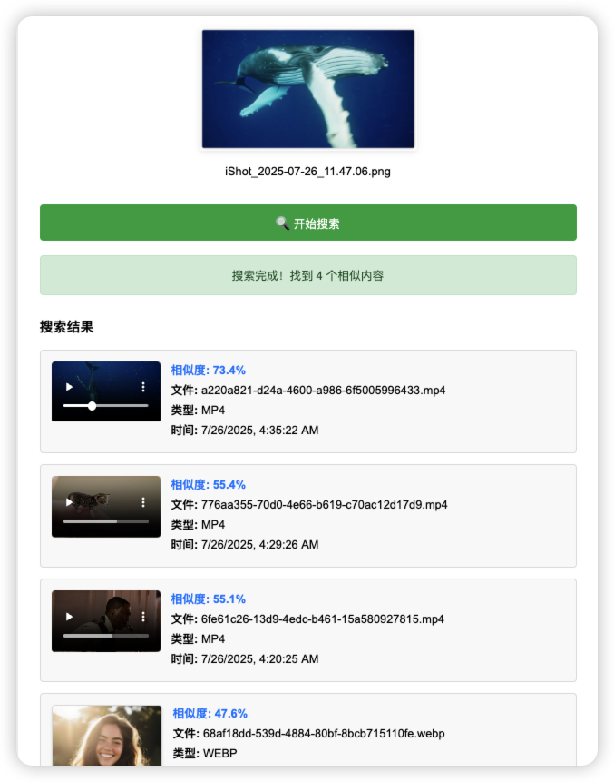
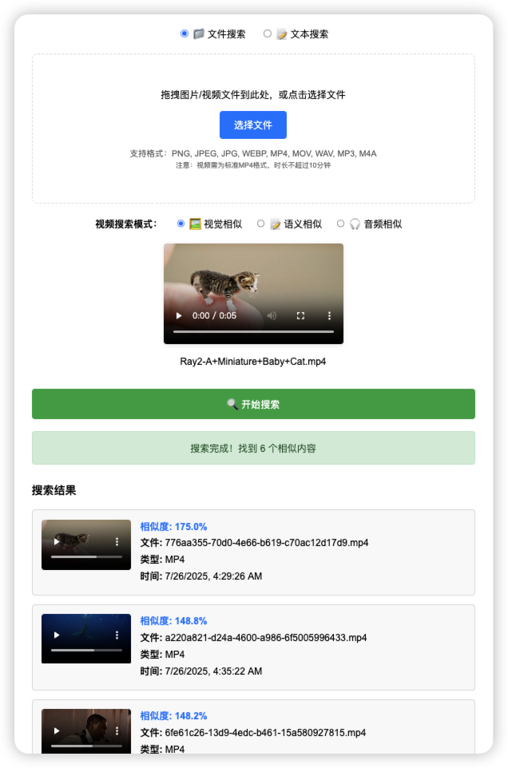

# 基于Amazon Bedrock的TwelveLabs Marengo Embed 2.7多模态搜索系统

*本文展示如何通过AI辅助开发，在零手工编码的情况下构建生产就绪的多模态搜索应用，完整体验Amazon Bedrock上TwelveLabs Marengo Embed 2.7模型的跨模态AI能力。*

## 🚀 项目亮点

### 🎯 完整多模态体验系统
构建了一个**端到端的多模态搜索演示系统**，让用户能够直观体验Marengo Embed 2.7的强大跨模态能力，包括文本到图像、文本到视频、文本到音频以及文件间的相似性搜索。

### ✨ AI辅助开发实践
本项目**完全通过AI辅助开发完成**，开发者未编写任何一行代码。从架构设计、代码实现、部署配置到问题调试，全程由Amazon Q Developer AI助手完成，展示了AI驱动开发的巨大潜力。

## 引言

在AWS Summit New York上，我们宣布TwelveLabs视频理解模型正式登陆Amazon Bedrock，其中包括突破性的**Marengo Embed 2.7**模型。该模型代表了多模态AI的重大进步，在单一的1024维向量空间内提供跨图像、视频、音频和文本的统一嵌入生成。

与需要为每种模态使用单独模型的传统方法不同，Marengo Embed 2.7实现了真正的跨模态理解，允许开发者构建文本查询可以找到相关图像、图像可以匹配相似视频、音频内容可以与视觉元素语义链接的应用程序。

**更令人兴奋的是，本文展示的完整多模态搜索系统完全通过AI辅助开发实现，无需手工编写任何代码，为AI驱动的软件开发开辟了新的可能性。**

## Marengo Embed 2.7的独特之处

### 统一向量空间架构

传统多模态系统面临对齐不同向量空间的挑战：

```
传统方法：
图像模型 → 图像向量空间A
文本模型 → 文本向量空间B  
视频模型 → 视频向量空间C
音频模型 → 音频向量空间D
跨模态搜索 = 复杂的映射和转换 ❌

Marengo Embed 2.7：
所有模态 → 统一1024维向量空间
跨模态搜索 = 直接余弦相似度计算 ✅
```

### 高级视频理解

该模型为视频内容提供三种不同的嵌入类型：
- **visual-image**：针对视觉相似性匹配优化
- **visual-text**：专为语义文本到视频搜索设计
- **audio**：捕获包括音乐、语音和环境声音在内的音频特征

### 企业级特性

- **异步处理**：为大文件的生产工作负载而构建
- **AWS集成**：与Amazon Bedrock基础设施原生集成
- **可扩展架构**：自动扩展和负载均衡
- **安全性**：内置访问控制和加密

## 解决方案架构

为了完整体验Marengo Embed 2.7的能力，我们**通过AI辅助开发**构建了一个基于**Serverless无服务器架构**的综合多模态搜索系统。整个开发过程中，从架构设计到代码实现，从部署配置到问题调试，**开发者未编写任何一行代码**，全程由Amazon Q Developer AI助手完成：


### 系统执行流程

系统通过两个主要工作流程运行：**文件上传与处理**和**搜索与检索**。

#### 文件上传与处理工作流程

 **用户交互**：用户通过Amazon CloudFront访问网络界面，通过拖放或文件选择上传媒体文件（图像、视频、音频）。

 **API处理**：文件转换为base64格式，通过Amazon API Gateway发送到主AWS Lambda函数，进行文件类型和大小限制（最大10MB）验证。

 **Amazon S3存储**：AWS Lambda解码base64数据并将原始文件上传到Amazon S3进行持久化存储。

 **Amazon S3事件触发**：Amazon S3在上传新文件时自动触发专用的嵌入AWS Lambda函数，启动嵌入生成过程。

 **Amazon Bedrock调用**：嵌入AWS Lambda异步调用Amazon Bedrock的Marengo Embed 2.7模型，为所有媒体类型生成统一的1024维嵌入向量。

 **向量存储**：嵌入AWS Lambda将生成的嵌入向量与元数据一起存储在Amazon OpenSearch Service中，创建可搜索的向量数据库。

#### 搜索与检索工作流程

 **搜索请求**：用户通过网络界面使用上传文件或文本查询启动搜索，可选择不同的搜索模式（视觉、语义、音频）。

 **API处理**：搜索请求通过Amazon API Gateway发送到搜索API AWS Lambda函数进行初始处理。

 **任务创建**：搜索API AWS Lambda在Amazon DynamoDB中创建搜索任务记录，并向Amazon SQS队列发送消息进行异步处理。

 **队列处理**：搜索API AWS Lambda向Amazon SQS队列发送消息进行异步处理。

 **工作器激活**：搜索工作AWS Lambda被Amazon SQS消息触发，提取搜索参数并准备嵌入生成。

 **查询嵌入**：工作AWS Lambda调用Amazon Bedrock的Marengo模型为搜索查询（文本或上传文件）生成嵌入向量。

 **向量搜索**：工作AWS Lambda在Amazon OpenSearch Service中使用余弦相似度执行相似性搜索，对跨模态查询使用不同策略，然后在Amazon DynamoDB中更新结果供前端轮询。

### 工作流程集成

两个工作流程共享通用基础设施组件但服务于不同目的：
- **上传工作流程（1-6）**：专注于摄取和处理媒体文件以构建可搜索的向量数据库
- **搜索工作流程（1-7）**：处理用户查询并从预构建的向量数据库中检索相关结果
- **共享组件**：两个工作流程都利用相同的Amazon Bedrock模型、Amazon OpenSearch Service索引和核心AWS服务以保持一致性

### 关键技术特性

- **统一向量空间**：所有媒体类型（图像、视频、音频、文本）都嵌入到相同的1024维空间中，实现真正的跨模态搜索
- **异步处理**：Marengo Embed 2.7需要异步调用，通过Amazon SQS队列和工作AWS Lambda函数处理
- **多模态搜索**：支持文本到图像、文本到视频、文本到音频和文件到文件的相似性搜索
- **可扩展架构**：无服务器设计根据需求自动扩展，无需基础设施管理
- **实时状态**：类似WebSocket的轮询提供处理状态和搜索结果的实时更新

## 演示演练

为了说明系统的能力，让我们通过用户界面和关键功能进行演练：

### 系统概览


应用程序提供了直观的界面，包含三个主要模块：
- **文件上传**：支持图像、视频和音频文件
- **异步搜索**：基于文件和基于文本的搜索模式
- **实时处理**：状态跟踪和结果显示

### 文件上传和处理



系统支持多种媒体格式，具有拖放功能：
- **图像格式**：PNG、JPEG、JPG、WEBP
- **视频格式**：MP4、MOV
- **音频格式**：WAV、MP3、M4A
- **文件大小限制**：每个文件10MB

### 搜索能力


用户可以上传媒体文件来查找不同模态的相似内容。对于视频文件，系统提供多种搜索模式：
- **视觉相似性**：基于视觉内容匹配
- **语义相似性**：基于内容理解
- **音频相似性**：基于音频特征匹配


基于文本的搜索实现了真正的跨模态检索，允许用户使用自然语言描述找到相关的图像、视频和音频内容。

### 搜索结果和跨模态匹配



结果显示包括：
- **相似度分数**：量化匹配置信度
- **媒体预览**：视频和音频的直接播放
- **元数据**：文件类型、上传时间和其他详细信息
- **排序**：按相关性排序的结果


系统演示了不同的搜索模式：
- **视觉搜索**：专注于颜色、形状和视觉元素
- **语义搜索**：强调内容理解和概念匹配
- **音频搜索**：针对声音特征和音频特性

### 异步处理


由于Marengo的异步处理模型，系统提供实时状态更新：
- **处理状态**：显示嵌入生成进度
- **完成通知**：自动重定向到结果
- **错误处理**：清晰的错误消息和建议


### 素材管理


系统提供了完整的素材管理功能，帮助用户有效管理和监控上传的多媒体内容：
- **素材展示**：以卡片形式展示所有已上传的图像、视频和音频文件
- **处理状态监控**：实时显示每个素材的embedding生成状态（处理中、已完成、失败）
- **智能筛选**：支持按素材类型（图像、视频、音频）和处理状态进行筛选
- **状态指示器**：通过颜色编码清晰标识不同的处理状态
- **批量管理**：便于用户批量查看和管理大量素材文件

### 多模态搜索实战演示

系统支持多种搜索模式，以下展示了实际运行中的各种跨模态搜索场景：

#### 图像搜索


使用图像作为查询输入，系统能够：
- **视觉相似性匹配**：找到具有相似视觉特征的图像和视频
- **跨模态检索**：基于视觉内容发现相关媒体
- **实时处理**：上传图像后立即开始embedding生成和搜索

#### 视频搜索



视频文件搜索展示了Marengo Embed 2.7的强大多模态能力：
- **多重embedding生成**：同时提取视觉、文本和音频特征
- **智能匹配**：根据内容类型选择最佳embedding进行搜索
- **异步处理**：处理大型视频文件的完整工作流程

#### 音频搜索


音频文件的跨模态搜索能力：
- **音频格式支持**：WAV、MP3、M4A主流格式
- **音频特征提取**：捕获音乐、语音和环境声音特征
- **相似性匹配**：找到具有相似音频特征的内容

#### 文本到图像和视频搜索


文本查询的跨模态检索展示了真正的语义理解：
- **自然语言处理**：理解复杂的文本描述
- **跨模态匹配**：文本描述匹配相关的图像和视频内容
- **语义相似性**：基于内容理解而非关键词匹配

#### 文本到音频搜索


文本到音频的跨模态搜索展示了Marengo Embed 2.7的强大语义理解能力：
- **语义音频匹配**：使用自然语言描述找到相关音频内容，如“欢快的音乐”、“海浪声”等
- **音频播放器集成**：搜索结果中的直接播放控件，支持即时试听
- **相似度评分**：量化文本到音频内容匹配的准确性，帮助用户理解结果相关性
- **音频内容匹配**：基于音频特征进行语义匹配，支持各种音频文件格式

## 实现细节

### 1. 嵌入生成

核心功能利用Marengo Embed 2.7对所有媒体类型的统一API：

```python
def generate_embedding(media_type, s3_uri, bucket_name):
    """使用Marengo Embed 2.7生成嵌入"""
    
    # 根据媒体类型配置输入
    if media_type == "image":
        model_input = {
            "inputType": "image",
            "mediaSource": {
                "s3Location": {
                    "uri": s3_uri,
                    "bucketOwner": account_id
                }
            }
        }
    elif media_type == "video":
        model_input = {
            "inputType": "video",
            "mediaSource": {
                "s3Location": {
                    "uri": s3_uri,
                    "bucketOwner": account_id
                }
            }
            # 省略embeddingTypes以获取所有可用类型
        }
    elif media_type == "audio":
        model_input = {
            "inputType": "audio",
            "mediaSource": {
                "s3Location": {
                    "uri": s3_uri,
                    "bucketOwner": account_id
                }
            }
        }
    elif media_type == "text":
        model_input = {
            "inputType": "text",
            "inputText": text_content
        }
    
    # 异步调用（Marengo必需）
    response = bedrock_client.start_async_invoke(
        modelId='twelvelabs.marengo-embed-2-7-v1:0',
        modelInput=model_input,
        outputDataConfig=output_config
    )
    
    return response
```

### 2. 向量存储策略

系统使用统一模式在Amazon OpenSearch Service中存储嵌入：

```json
{
  "visual_embedding": [0.1, 0.2, ...],    // 图像和视频视觉特征
  "text_embedding": [0.3, 0.4, ...],     // 视频文本/语义特征  
  "audio_embedding": [0.5, 0.6, ...],    // 视频和音频特征
  "s3_uri": "s3://bucket/file.mp4",
  "file_type": "mp4",
  "timestamp": "2024-01-25T10:00:00Z"
}
```

### 3. 智能搜索实现

搜索逻辑根据查询类型和目标媒体进行调整：

```python
def cross_modal_search(query_embedding, query_type):
    """实现跨模态搜索逻辑"""
    
    if query_type == 'text':
        # 文本查询：通过visual_embedding搜索图像，
        # 通过text_embedding搜索视频，通过audio_embedding搜索音频
        search_body = {
            "query": {
                "bool": {
                    "should": [
                        {
                            "bool": {
                                "must": [
                                    {"knn": {"visual_embedding": {"vector": query_embedding, "k": 5}}},
                                    {"terms": {"file_type": ["png", "jpg", "jpeg", "webp"]}}
                                ]
                            }
                        },
                        {
                            "bool": {
                                "must": [
                                    {"knn": {"text_embedding": {"vector": query_embedding, "k": 5}}},
                                    {"terms": {"file_type": ["mp4", "mov"]}}
                                ]
                            }
                        },
                        {
                            "bool": {
                                "must": [
                                    {"knn": {"audio_embedding": {"vector": query_embedding, "k": 5}}},
                                    {"terms": {"file_type": ["wav", "mp3", "m4a"]}}
                                ]
                            }
                        }
                    ]
                }
            }
        }
    else:
        # 文件查询：使用visual_embedding进行相似性搜索
        search_body = {
            "query": {
                "knn": {
                    "visual_embedding": {
                        "vector": query_embedding,
                        "k": 10
                    }
                }
            }
        }
    
    return opensearch_client.search(index='embeddings', body=search_body)
```

## 关键特性和能力

### 支持的媒体格式
- **图像**：PNG、JPEG、JPG、WEBP
- **视频**：MP4、MOV  
- **音频**：WAV、MP3、M4A
- **文本**：自然语言查询

### 跨模态搜索场景

1. **文本到图像**：查找匹配文本描述的图像
2. **文本到视频**：基于语义查询定位视频内容
3. **文本到音频**：通过描述性文本发现音频内容
4. **图像到视频**：查找具有相似视觉内容的视频
5. **文件到文件**：在所有格式中定位相似媒体

## 性能指标

基于演示系统的测试，以下是关键性能特征：

### 处理时间
- **文本嵌入**：2-5秒
- **图像嵌入**：10-30秒  
- **视频嵌入**：1-5分钟（取决于长度）
- **音频嵌入**：30秒-2分钟

### 搜索性能
- **查询响应时间**：向量相似性搜索<500ms
- **并发用户**：通过Lambda自动扩展
- **存储效率**：1024维向量（每个嵌入4KB）


## 性能和可扩展性

### 资源配置
- **AWS Lambda内存**：嵌入处理1024MB
- **AWS Lambda超时**：大文件处理15分钟
- **Amazon OpenSearch Service**：1024维向量空间
- **文件大小限制**：每个文件10MB（Amazon API Gateway约束）


## 最佳实践和经验教训

### 1. 异步处理至关重要
Marengo Embed 2.7仅支持异步调用。相应地设计您的架构：

```python
# ✅ 正确：异步调用
response = bedrock_client.start_async_invoke(
    modelId='twelvelabs.marengo-embed-2-7-v1:0',
    modelInput=model_input,
    outputDataConfig=output_config
)

# ❌ 错误：同步调用将失败
response = bedrock_client.invoke_model(...)
```

### 2. 针对不同媒体类型优化
- **图像**：单一视觉嵌入
- **视频**：多个嵌入（visual-image、visual-text、audio）
- **音频**：单一音频嵌入
- **文本**：单一文本嵌入

### 3. 实现适当的错误处理
```python
def poll_async_result(invocation_arn, max_attempts=60):
    """轮询异步调用结果，具有适当的错误处理"""
    for attempt in range(max_attempts):
        try:
            response = bedrock_client.get_async_invoke(invocationArn=invocation_arn)
            
            if response["status"] == "Completed":
                return process_output(response)
            elif response["status"] in ("Failed", "Cancelled"):
                raise Exception(f"调用失败: {response.get('failureMessage')}")
                
            time.sleep(5)  # 下次轮询前等待
            
        except Exception as e:
            if attempt == max_attempts - 1:
                raise e
            time.sleep(5)
    
    raise TimeoutError("异步调用超时")
```

## 部署指南

### 先决条件
- 配置了适当权限的AWS CLI
- 安装AWS CDK v2
- Python 3.11+和Node.js 18+

### 快速部署
```bash
# 克隆仓库
git clone <repository-url>
cd aws-multimodal-embedding

# 配置服务前缀
export SERVICE_PREFIX="your-project-name"

# 部署基础设施
cd infrastructure
cdk deploy --require-approval never

# 上传前端资源
aws s3 sync ../frontend/ s3://${SERVICE_PREFIX}-frontend/
```

### 所需AWS权限
部署需要以下权限：
- Amazon Bedrock模型访问
- AWS Lambda函数创建和执行
- Amazon OpenSearch Serverless集合管理
- Amazon S3存储桶操作
- Amazon API Gateway配置
- Amazon CloudFront分发设置

## 用例和应用

### 内容管理系统
- **媒体资产发现**：查找相似的图像、视频或音频文件
- **内容标记**：基于内容分析自动标记媒体
- **重复检测**：识别跨格式的相似或重复内容

### 电商平台
- **视觉产品搜索**：使用图像或文本描述查找产品
- **视频产品演示**：将产品视频与客户查询匹配
- **音频品牌识别**：识别品牌相关音频内容

### 教育平台
- **学习资源发现**：查找相关的多媒体教育内容
- **内容推荐**：建议跨不同格式的相关材料
- **可访问性**：为多样化学习需求在不同媒体类型间转换

### 媒体和娱乐
- **内容库搜索**：在庞大的多媒体档案中搜索
- **相似内容推荐**：建议相关视频、音乐或图像
- **内容审核**：识别相似内容以执行政策


## 安全建议

### 数据隐私
- 所有媒体文件在您的AWS账户内处理
- 嵌入存储在您的OpenSearch集群中
- 不与外部服务共享数据

### 访问控制
```python
# AWS Lambda执行角色的IAM策略
{
    "Version": "2012-10-17",
    "Statement": [
        {
            "Effect": "Allow",
            "Action": [
                "bedrock:InvokeModel",
                "bedrock:StartAsyncInvoke",
                "bedrock:GetAsyncInvoke"
            ],
            "Resource": "arn:aws:bedrock:*:*:model/twelvelabs.marengo-embed-2-7-v1:0"
        },
        {
            "Effect": "Allow",
            "Action": [
                "s3:GetObject",
                "s3:PutObject"
            ],
            "Resource": "arn:aws:s3:::your-bucket/*"
        }
    ]
}
```

## 未来增强

### 可增加功能
- **实时处理**：实时内容的流式嵌入
- **高级过滤**：基于元数据的搜索细化
- **多语言支持**：扩展语言能力
- **自定义模型**：针对特定领域用例的微调
- **成本优化**：嵌入缓存策略和批处理优化，减少API调用成本

```python
def get_cached_embedding(file_hash, media_type):
    """实现缓存以减少API调用"""
    cache_key = f"{file_hash}:{media_type}"
    
    # 检查Amazon DynamoDB缓存
    cached_result = dynamodb_table.get_item(Key={'cache_key': cache_key})
    
    if 'Item' in cached_result:
        return cached_result['Item']['embedding']
    
    # 如果未缓存则生成新嵌入
    embedding = generate_embedding(media_type, s3_uri, bucket_name)
    
    # 存储在缓存中
    dynamodb_table.put_item(
        Item={
            'cache_key': cache_key,
            'embedding': embedding,
            'ttl': int(time.time()) + ttl_seconds  # 设置适当的TTL
        }
    )
    
    return embedding
```

对于大规模部署，考虑实现批处理以优化成本和吞吐量。

### 集成机会
- **Amazon Rekognition**：增强图像分析
- **Amazon Transcribe**：音频到文本转换
- **Amazon Translate**：多语言搜索能力
- **Amazon Personalize**：个性化内容推荐

## 结论

Amazon Bedrock上的TwelveLabs Marengo Embed 2.7代表了多模态AI能力的重大进步。通过为所有媒体类型提供统一的向量空间，它简化了复杂跨模态搜索应用的开发，同时保持企业级性能和安全性。

本文演示的无服务器架构展示了如何构建可自动扩展的生产就绪多模态应用，同时保持成本优化。随着多模态AI的持续发展，这样的解决方案对于希望释放其多样化媒体资产价值的组织将变得越来越重要。

### 关键要点
- **统一方法**：单一模型处理所有媒体类型
- **生产就绪**：基于AWS无服务器基础设施构建  
- **成本效益**：按使用付费定价和优化策略
- **可扩展**：基于需求自动扩展
- **安全**：企业级安全和隐私控制

对于准备探索多模态AI能力的组织，Marengo Embed 2.7提供了一个具有强大跨模态理解能力的可访问入口点。

---

## 其他资源

- [Amazon Bedrock用户指南](https://docs.aws.amazon.com/bedrock/)
- [TwelveLabs Marengo模型文档](https://docs.aws.amazon.com/bedrock/latest/userguide/model-parameters-marengo.html)
- [Amazon OpenSearch Service开发者指南](https://docs.aws.amazon.com/opensearch-service/)
- [AWS CDK开发者指南](https://docs.aws.amazon.com/cdk/)


*本文中显示的示例代码和架构模式可在[GitHub仓库](https://github.com/valyli/aws-multimodal-embedding)中获得。*